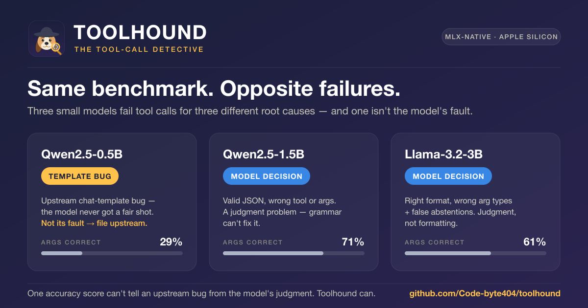

<p align="center">
  
</p>

<h1 align="center">Toolhound</h1>

<p align="center">
  <b>The tool-call detective for small models on Apple Silicon.</b><br>
  When a small model botches a tool call, Toolhound tells you <i>who did it</i> —
  the chat template, the framework parser, or the model itself.
</p>

<p align="center">
  <a href="#quickstart"></a>
  
  
  
  
</p>

<p align="center">
  
</p>

---

## The 60-second pitch

Everyone benchmarks tool-calling with a single number: *"Model X gets 71% of function calls right."*
That number is a **lie of omission**. It can't tell you *why* the other 29% failed — and the *why* is
the only thing that tells you what to do next.

Two models can score the *same* accuracy for completely different reasons:

| Model | Same task, its dominant failure is… | So the fix is… |
|---|---|---|
| **Qwen2.5-0.5B** | 🧩 the chat template mangles tool tokens | **File a bug upstream** — the model was never given a fair chance |
| **Qwen2.5-1.5B** | 🧠 valid JSON, wrong tool/args | **Better model or better prompt** — grammar can't fix judgment |
| **Llama-3.2-3B** | 🧠 valid JSON, wrong tool/args | **Better model or better prompt** |

> One of those is *not the model's fault.* A plain accuracy score hides that. **Toolhound doesn't.**

Toolhound is a **reproducible diagnostic harness** that runs entirely on your Mac (via
[MLX](https://github.com/ml-explore/mlx)) and attributes **every single failure** to one of four causes —
with bootstrap confidence intervals on every metric.

---

## The four suspects 🔍

Every failed tool call gets pinned on exactly one culprit:

| Cause | Whose fault | Reportable? |
|---|---|---|
| `framework_template_bug` | The chat template / tokenizer mangled the tool tokens | ✅ Upstream bug |
| `framework_parser_gap` | The model emitted a rescuable call; the framework parser missed it | ✅ Upstream bug |
| `model_format_failure` | The model can't emit a parseable call at all | The model |
| `model_decision_failure` | Valid format, but wrong tool or wrong arguments | The model |

The trick that makes this attribution *valid*: **the parser is lenient ("宽进"), the scorer is strict ("严判").**
We decouple *"could any reasonable parser rescue this output?"* from *"is this the correct answer?"* — so a
format failure is never confused with a judgment failure, and an upstream parser gap is never blamed on the model.

---

## Why this exists (and what it is *not*)

Toolhound is a **measuring stick**, not another schema-adaptation method. Its value is *honest measurement*:

- ✅ It **finds** chat-template bugs and parser gaps — and gives you a minimal repro to file upstream.
- ✅ It **separates** "the model can't format" from "the model can't decide" — because grammar-constrained
  decoding fixes the first and can *never* fix the second.
- ✅ It **quantifies** quantization damage (bf16 vs. q4) *without* confounding it with template differences.
- ✅ In v2, it **benchmarks existing zero-training fixes** (e.g. [PA-Tool](#roadmap)) on a held-out test set —
  never claiming an improvement unless its confidence interval is disjoint from baseline.

We are **not** the first to notice that chat templates break tool tokens, and we don't claim to be. Toolhound's
contribution is making that failure *legible, attributable, and reproducible* on consumer Apple hardware.

---

## Quickstart

> **Requires an Apple Silicon Mac** (M1 or newer), macOS 14+, Python 3.11+. MLX runs *only* on Apple Silicon —
> your conda env must be **arm64**, not Rosetta (`conda info` → platform should read `osx-arm64`).

```bash
git clone https://github.com/Code-byte404/toolhound.git
cd toolhound

conda create -n toolhound python=3.11 && conda activate toolhound
pip install -e ".[dev]"

# Smoke test: MLX loads a tiny non-gated model and generates one call
python scripts/smoke.py
```

Then run the detective on a model:

```bash
# 1) Reliability report: how often does each model get tool calls right?
toolprobe run \
  --model qwen2.5-1.5b \
  --quant bf16,q4 \
  --cases cases/default.jsonl \
  --out reports/

# 2) Attribution: for every failure, name the culprit (run under strict + lenient parsers)
toolprobe attribute --model qwen2.5-1.5b

# 3) Compare a zero-training fix against baseline (v2)
toolprobe run --model qwen2.5-1.5b --cases cases/test.jsonl --method baseline,pa_tool
```

Both commands write matching `*.json` (machine-readable) and `*.md` (human-readable) reports into `reports/`,
each stamped with a full reproducibility header: chip, RAM, macOS version, exact `mlx` / `mlx-lm` versions,
model repo + revision, and the injected date.

*(The bundled model keys — `qwen2.5-0.5b`, `qwen2.5-1.5b`, `llama-3.2-3b` — are registered in
`src/toolprobe/backend.py`; add your own there.)*

---

## What a report looks like

**Reliability** — layered scoring, so you see exactly where each model drops off:

```
Model: qwen2.5-1.5b  (q4)                     95% bootstrap CI · Apple M2 Pro
─────────────────────────────────────────────────────────────────────────
parse_ok          ███████████████████░  0.96  [0.92, 0.99]
schema_valid      ███████████████████░  0.96  [0.92, 0.99]
tool_correct      ███████████████████░  0.96  [0.92, 0.99]
args_correct      ██████████████░░░░░░  0.71  [0.63, 0.79]
```

**Attribution** — every failure pinned to a suspect, shown under *both* parser tiers so you can see the
conclusion doesn't flip when the parser gets more lenient:

```
Failure attribution (strict parser)           Failure attribution (lenient parser)
─────────────────────────────────             ─────────────────────────────────
framework_template_bug     4                   framework_template_bug     4
framework_parser_gap       6   ← rescuable!    framework_parser_gap       1
model_format_failure       9                   model_format_failure       8
model_decision_failure    22                   model_decision_failure    22
```

*(Reliability numbers above are from a real bundled 3-model run on an Apple M2 Pro; the attribution
counts show the two-tier layout — run `toolprobe attribute` for your own CI-backed figures.)*

### Does a proposed fix actually help? (v2)

When you benchmark a method against baseline, Toolhound doesn't just print a delta — it flags each metric
`credible` **only** when the method's bootstrap CI is *disjoint* from baseline's. In a bundled 3-model demo
run, [PA-Tool](#roadmap) (a real zero-training tool-renaming method) didn't clear that bar on any metric — and
on one model it measurably *hurt* argument accuracy:

```
Method comparison — qwen2.5-1.5b (q4) · pa_tool vs. baseline
────────────────────────────────────────────────────────────
metric          baseline   pa_tool    delta    credible
tool_correct      0.96       0.96      +0.00      no
args_correct      0.71       0.43      −0.28      no   ← caught, not rubber-stamped
```

That's the entire point of a measuring stick: **it tells you when a fix *doesn't* work, with the statistics to
back it up.** *(Demonstration on the exploratory `default.jsonl`; real method selection uses the held-out
`dev` / `test` split so a gain has to generalize to unseen slots.)*

---

## How the attribution works

For the design rationale behind the four causes, parser/scorer split, confidence
intervals, dev/test discipline, and fair-prompt rule, see
[`docs/methodology.md`](docs/methodology.md).

```
                       ┌─────────────────────────┐
   raw model output →  │  template_sanity check   │  tokens survived round-trip?
                       └───────────┬──────────────┘
                          no │             │ yes
                             ▼             ▼
              framework_template_bug   ┌───────────────────────────┐
                                       │  parse_framework (strict) │  did the framework see a call?
                                       └───────┬───────────────────┘
                                          no   │           │ yes
                                               ▼           ▼
                              ┌────────────────────────┐   scorer (strict):
                              │  parse_rescue (lenient) │   right tool? right args?
                              └────┬───────────────┬───┘        │
                             rescued│          garbage│         ▼
                                    ▼               ▼    model_decision_failure
                          framework_parser_gap   model_format_failure
```

The pipeline is a clean, testable data flow — each stage is a pure function with one job:

```
case → templates → runner → parser → scorer → attribution → report
```

Only **one** module (`backend.py`) is allowed to import `mlx` / `mlx_lm`; a hygiene test enforces it. That
keeps the parser, scorer, and attribution logic 100% pure and unit-testable on *any* machine (no Mac required
for the logic tier — 101 tests run in <1s in CI).

---

## Roadmap

- [x] **v1** — diagnostic harness + four-cause attribution + bootstrap CIs (this release)
- [x] **v2 (in progress)** — 304-case dev/test dataset with slot-disjoint splits; `PA-Tool` method integration
- [ ] **v1.1 seam** — grammar-constrained decoding (Outlines / XGrammar) — the abstention-safe grammar hook is
  already reserved in `backend.py`
- [ ] **More methods** — TSCG, constrained decoding benchmarks (integrate & measure existing work — *not* invent new)
- [ ] **More models** — expand the registry beyond Qwen / Llama
- [ ] **PNG report export** for dropping straight into issues and blog posts

---

## Contributing — we want detectives 🕵️

This is a young project with a clear mission and a lot of **well-scoped, self-contained** ways to help. If any
of these sound fun, open an issue and say hi:

- **🧩 Add a model** to the registry and file the template/parser bugs Toolhound finds upstream.
- **🧪 Add test cases** — especially tricky abstention traps (utterances that *look* like tool requests but aren't).
- **🔬 Implement the constrained-decoding seam** (`backend.generate(grammar=...)` is stubbed and waiting).
- **📊 Add a method** — wire an existing zero-training tool-calling fix into the `methods/` framework and let the
  benchmark judge it fairly.
- **📖 Docs** — help port the methodology notes to English.

Every metric in this project has a confidence interval and every logic path has a test. Please keep it that way —
`ruff check . && pytest` is the bar, and any claimed improvement must show **non-overlapping CIs vs. baseline**.

**New here?** → **[CONTRIBUTING.md](CONTRIBUTING.md)** walks you from clone to merged PR (dev setup, the hard
rules, the bar), and the [good first issues](https://github.com/Code-byte404/toolhound/labels/good%20first%20issue)
are concrete places to start.

---

## Reproducibility, by design

- `temperature=0`, `top_p=1`, fixed seed — deterministic generation.
- Confidence intervals come from **bootstrap resampling over the case set**, not seed variance.
- bf16 vs. q4 comparisons **assert an identical tokenizer + chat template** first, so quantization damage is
  never confounded with template differences.
- Every model is tested with **its own** chat template's tool format — never a hand-rolled one.
- Dates like "today / Friday" are pinned to a fixed injected date so runs are reproducible forever.

The whole report table is re-runnable with a single command.

---

## Contact & collaboration

This project is actively looking for collaborators. Whether you want to add a model, contribute test cases,
port a method, or just compare notes on small-model tool-calling reliability — I'd love to hear from you.

- 🐛 **Issues & ideas:** open a [GitHub issue](https://github.com/Code-byte404/toolhound/issues)
- ✉️ **Reach the maintainer:** [frankfish1984@gmail.com](mailto:frankfish1984@gmail.com)

## License

Released under the **Apache License 2.0**. See [`LICENSE`](LICENSE).

## Acknowledgements

Built on [MLX](https://github.com/ml-explore/mlx) and [mlx-lm](https://github.com/ml-explore/mlx-lm) by Apple.
Method integrations credit their original authors (see each file in `src/toolprobe/methods/`).

<p align="center"><sub>Toolhound ships as the <code>mlx-toolprobe</code> package with the <code>toolprobe</code> CLI. 🐾</sub></p>
